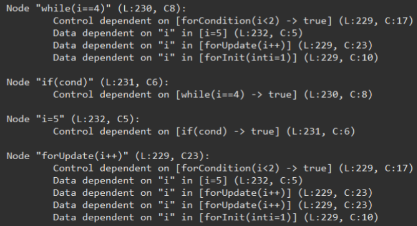
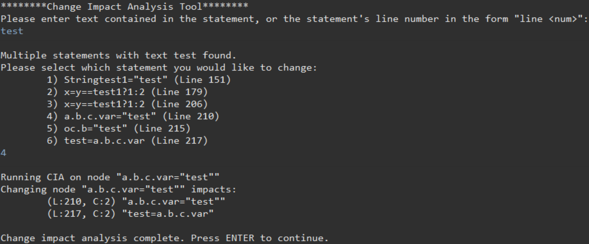
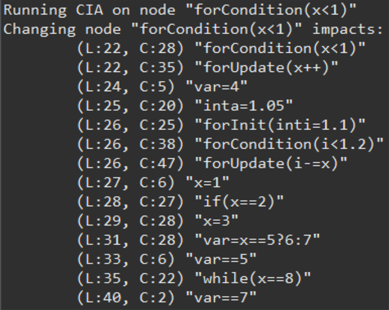

AnalysisTool.java - Source code for our Change Impact Analysis program
GeneratedANTLRFiles.zip - the files generated from our ANTLR grammar, using ANTLR4.13 (provided in ProjectStructure.zip)
Java1_4.g4 - Our ANTLR grammar
ProjectStructure.zip - A duplicate of the above files, preserved in their original hierarchy in our project, as well as our ANTLR jar.

FinalReport.pdf - Our final report, including details and links to evaluation
TestSamples.zip - Our test samples used throughout the project

# 🔍 Java Change Impact Analysis Tool (2025)

A static analysis tool built in Java using ANTLR that performs **Change Impact Analysis (CIA)** by constructing a **Program Dependency Graph (PDG)** from Java source code.  
The tool identifies which lines of code may be affected when a specific line is modified by recursively traversing control and data dependencies.



---

### 🔧 Background
When modifying a large codebase, determining the full impact of a change is difficult.  
A seemingly small modification can affect distant parts of the program through:
- control flow relationships
- variable dependencies
- branching logic
- exception handling
- indirect propagation chains

This project analyzes Java source code statically and builds a graph-based representation of program dependencies to automate this process.

**Why it matters:**  
Change impact analysis is important in:
- software maintenance
- refactoring
- regression testing
- compiler tooling
- IDE assistance systems
- program comprehension

The project demonstrates techniques commonly used in static analysis, compiler infrastructure, and software engineering research.

---

### 🎯 Key Features
- Parses Java source code using **ANTLR**
- Constructs:
  - Control Flow Graphs (CFGs)
  - Control Dependency Graphs (CDGs)
  - Data Dependency Graphs (DDGs)
  - Program Dependency Graphs (PDGs)
- Performs recursive change impact propagation analysis
- Tracks both:
  - explicit data dependencies
  - implicit control dependencies
- Handles complex control structures:
  - loops
  - branching
  - break/continue/return/throw statements
  - partial try/catch support
- Interactive CLI for:
  - searching source lines
  - selecting ambiguous matches
  - displaying impacted lines

&nbsp;

# 🧠 Implementation Overview

### Program Dependency Graph Construction
The project centers around constructing a **Program Dependency Graph (PDG)** from Java source code.

The PDG combines:
- a **Control Dependency Graph (CDG)**
- a **Data Dependency Graph (DDG)**

Both are derived from a Control Flow Graph (CFG).



---

### Parsing Java Source Code with ANTLR
Java source files are parsed using ANTLR-generated parsers and listeners.

The parser:
- traverses Java syntax trees
- extracts statements and expressions
- identifies identifiers and assignments
- builds internal graph node representations

Custom node hierarchies were built to represent:
- statements
- control constructs
- dependencies
- graph relationships

---

### Control Dependency Analysis (CDG)
Control dependencies determine whether execution of one statement depends on another statement’s branching outcome.

The algorithm:
1. Builds a Control Flow Graph (CFG)
2. Identifies CFG nodes with multiple outgoing edges
3. Treats these nodes as **control candidates**
4. Recursively traverses incoming CFG edges backwards
5. Creates dependency edges when execution depends on a prior branching condition

Example:
```java
if (x > 0) {
    y = 5;
}
```

`y = 5` is control dependent on `x > 0`.

Special handling was implemented for:
- `break`
- `continue`
- `return`
- `throw`
- partial try/catch semantics

---

### Data Dependency Analysis (DDG)
Data dependencies determine whether one statement relies on values written by another statement.

The DDG builder:
1. Extracts reads and writes from each statement
2. Tracks identifiers and assignment operators
3. Recursively traverses incoming CFG paths
4. Locates the most recent writes relevant to each read

Example:
```java
x = 5;
y = x + 1;
```

`y = x + 1` is data dependent on `x = 5`.

Unlike earlier attempts that reasoned about code sequentially, the final implementation uses CFG traversal directly to correctly handle nested branching and control flow.

---

### Recursive Change Impact Analysis
Once the PDG is built, change impact analysis becomes a graph traversal problem.

Given a selected line:
- recursively follow all outgoing PDG edges
- collect all reachable dependent nodes
- return all potentially impacted lines

This allows the tool to detect:
- direct effects
- indirect propagation chains
- control-based impacts
- data-based impacts



&nbsp;

# 📚 Technical Breakdown <sub><sup>(the interesting part!)</sup></sub>

### 1. Building the Control Dependency Graph
*Detecting implicit execution dependencies through CFG traversal.*

> <details>
> <summary><strong>Click to Expand</strong></summary>
>
> ## Identifying Control Candidates
> Nodes with multiple outgoing CFG edges are treated as control candidates.
>
> These correspond to constructs like:
> - `if`
> - `while`
> - `for`
> - `switch`
>
> Since execution branches at these nodes, downstream statements may depend on their outcome.
>
> ---
>
> ## Backward CFG Traversal
> For each node:
> - recursively follow incoming CFG edges backwards
> - stop upon reaching relevant control candidates
> - verify the node lies within the construct’s scope
>
> This prevents incorrect dependencies from being added when a statement executes regardless of branch outcome.
>
> ---
>
> ## Special Cases
> Additional handling was required for:
> - `break`
> - `continue`
> - `return`
> - `throw`
> - try/catch constructs
>
> These do not fit neatly into ordinary branch semantics and required custom dependency logic.
>
> ---
>
> ## Try/Catch Complexity
> Try/catch constructs proved especially difficult because execution may depend on exceptions being thrown.
>
> Example:
>
> ```java
> try {
>     x = 4.02;
>     x = 4.03;
> } catch (...) {
> }
> ```
>
> `x = 4.03` may be control dependent on whether `x = 4.02` throws an exception.
>
> This forced substantial redesign of the CDG generation process.
>
> </details>

&nbsp;

### 2. Building the Data Dependency Graph
*Tracing variable reads and writes across branching control flow.*

> <details>
> <summary><strong>Click to Expand</strong></summary>
>
> ## Extracting Reads and Writes
> A custom ANTLR listener identifies:
> - identifiers
> - assignment operators
> - read/write relationships
>
> Example:
>
> ```java
> a = b + c;
> ```
>
> Reads:
> - `b`
> - `c`
>
> Writes:
> - `a`
>
> ---
>
> ## CFG-Based Traversal
> Earlier implementations attempted to reason about dependencies sequentially.
>
> This failed in deeply nested branching structures.
>
> The final approach instead:
> - recursively traverses incoming CFG edges
> - identifies the most recent writes along each path
> - creates DDG edges from those writes
>
> This significantly improved correctness and reduced implementation complexity.
>
> ---
>
> ## Why CFG Traversal Matters
> In branching code:
>
> ```java
> if (x) {
>     a = 1;
> } else {
>     a = 2;
> }
>
> b = a;
> ```
>
> `b = a` depends on both assignments to `a`.
>
> Sequential reasoning alone cannot correctly model this.
>
> </details>

&nbsp;

### 3. Recursive Change Propagation
*Turning the PDG into a practical change impact analysis tool.*

> <details>
> <summary><strong>Click to Expand</strong></summary>
>
> Once the PDG is complete:
>
> - the user selects a target line
> - the tool locates the corresponding graph node(s)
> - all outgoing dependency edges are recursively traversed
>
> Each reachable node is marked as impacted.
>
> This identifies:
> - direct dependencies
> - transitive dependencies
> - implicit control propagation
> - downstream effects
>
> ---
>
> ## CLI Interface
> The CLI supports:
> - searching for source lines
> - resolving ambiguous matches
> - selecting among multiple graph nodes
> - displaying impacted lines
>
> The interface was intentionally designed to make graph-based analysis usable without requiring graph visualization tooling.
>
> </details>

&nbsp;

### 4. Attempting Aliasing Support
*One of the project’s most technically difficult challenges.*

> <details>
> <summary><strong>Click to Expand</strong></summary>
>
> Supporting aliasing turned out to be substantially harder than anticipated.
>
> Example:
>
> ```java
> alias = object;
> alias.field = 5;
> ```
>
> Changes to `alias.field` may affect `object.field`.
>
> ---
>
> ## Initial Failure: Precomputed Aliases
> The first design globally precomputed aliases before DDG construction.
>
> This caused incorrect dependencies because aliases could become active before the assignment creating them executed.
>
> ---
>
> ## Incremental Aliasing
> A later approach incrementally established aliases during CFG traversal.
>
> This fixed premature alias activation but introduced additional complexity.
>
> ---
>
> ## Custom Identifier Hierarchies
> The final experimental design introduced custom identifier objects representing:
>
> ```text
> a.b.c.var
> ```
>
> as hierarchical parent-child relationships.
>
> This allowed:
> - qualified identifier tracking
> - object field differentiation
> - alias substitution
> - reference propagation
>
> While ultimately unfinished, this became one of the most technically sophisticated parts of the project.
>
> </details>

&nbsp;

# 🏆 Results & Impact

- Successfully constructed PDGs for substantial subsets of Java source code
- Achieved functioning recursive change impact analysis
- Supported many real-world control flow patterns and branching structures
- Demonstrated graph-based static analysis techniques commonly used in:
  - compilers
  - IDE tooling
  - software engineering research
- Developed custom solutions for difficult dependency problems involving:
  - nested control flow
  - exception handling
  - aliasing semantics
- Achieved approximately:
  - **90.87% tool effectiveness**
  - relative to manually constructed human dependency analysis on evaluation datasets

&nbsp;

# 🧹 Caveats

### Partial Language Support
Some Java language features are only partially supported or unsupported:
- array indexing semantics
- advanced aliasing
- nested try/catch edge cases
- certain nested ternary expressions

---

### Limited Real-World Testing
Testing focused primarily on:
- synthetic examples
- targeted edge cases
- evaluation samples

The tool was not extensively validated on large production codebases.

---

### Try/Catch Complexity
Exception-driven control flow introduced many difficult edge cases that do not integrate cleanly into traditional PDG construction algorithms.

Nested try/catch structures remain an area of uncertainty.

---

### No Automated Testing Framework
Much of the project’s validation was performed manually.

As dependency generation logic became increasingly interconnected, this significantly increased debugging difficulty and regression risk.

&nbsp;

# 🧠 Lessons Learned

### CFG Traversal Simplifies Dependency Reasoning
Our initial attempts reasoned directly about source structure.

Switching to CFG-driven traversal dramatically simplified both:
- control dependency construction
- data dependency construction

and substantially improved correctness.

---

### Graph-Based Analysis is Highly Interconnected
Small mistakes in dependency generation can cascade into:
- disconnected graphs
- false negatives
- incorrect propagation chains

This made debugging substantially harder than anticipated.

---

### Exception Semantics Are Surprisingly Difficult
Try/catch constructs fundamentally change execution guarantees.

Traditional “branch-based” dependency assumptions often break down in the presence of exceptions.

---

### Aliasing is Much Harder Than It Appears
Supporting references and qualified identifiers correctly required:
- hierarchical identifier modeling
- incremental alias propagation
- execution-aware analysis

This quickly evolved into a significantly larger problem than originally expected.

---

### Static Analysis Requires Balancing Correctness and Scope
Supporting every language edge case is prohibitively expensive.

A major part of the project became deciding:
- which constructs were worth supporting
- which assumptions were acceptable
- where implementation complexity outweighed practical benefit

&nbsp;

# ⚙️ How to Run

> <details>
> <summary><strong>Click to Expand</strong></summary>
>
> ## Requirements
> - Java
> - ANTLR runtime
>
> ---
>
> ## Usage
>
> 1. Clone the repository
>
> ```bash
> git clone <repo-url>
> ```
>
> 2. Build the project
>
> ```bash
> javac ...
> ```
>
> 3. Run the CLI
>
> ```bash
> java ...
> ```
>
> 4. Provide a Java source file and select a target line for analysis
>
> The tool will recursively display all impacted lines based on PDG traversal.
>
> </details>
